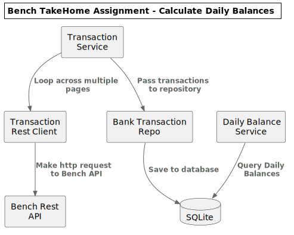

# Bench Take Home Test
Assignment : https://resttest.bench.co/

Write an app that can be run from the command line which:

* Connects to a REST API documented at https://resttest.bench.co/ and fetches all pages of financial transactions.
* Calculates running daily balances and prints them to the console.


# Application Requirements
- npm - version 8.1.4
- node - version v17.2.0
- python - version Python 2.7.18 (required for knex npm module to install)


# Installation Instructions
1. Checkout repo
> git clone git@github.com:pebbz/bench-takehome.git

2. Install npm packages
> yarn install

3. Initialize database
> ./reset_db.sh

4. Run application
> ./calculate_daily_summary.sh


# Developer Documentation


## Software Architecture


The application consists of two parts:
1. Fetch bank transactions from Bench Rest API and store in a database.

	- **[Transaction Service](/src/modules/TransactionService/TransactionService.ts)**
		- receives a Transaction Rest Client to fetch all transactions over multiple pages
		- receives a Bank Transaction Repo to store fetched transactions in a  database
	- **[Transaction Rest Client](/src/modules/TransactionRestClient/TransactionRestClient.ts)** makes http requests to the Bench Rest API
	- **[Bank Transaction Repo](/src/modules/BankTransactions/BankTransactionRepository.ts)** recieves a collection of transactions and saves those records to a database.

2. Calculate the Daily Balances
	- **[Daily Balance Service](/src/modules/DailyBalanceService/DailyBalanceService.ts)** queries the database for daily balances.


## Updating system diagram
The above system diagram is generated from PlantUML.com
Paste the UML code below into the [UML Diagram](http://www.plantuml.com/plantuml/uml/bLNHZjem47pFLsnvA3c9YX-egWkzNeNKgWYkwij9aMEMn2V7jcm7HB--Tk900WRrdcAFTcRNux7oQ2pHjgbvye49ofijmcUYQSLgOd6UzQilIMAPvGWd13QaLWxu14jXKGkqiD3oO50doHI-SQnHM9Ci6iC46fF_AjwGshG8-suxWqa6VGbqsEJXJ5ffITqtDRB67WpORB9nu9aSu25xWthFAARCRXgbfBO1S5sNBn0ms4bzLaapfJYZn38f89G_ECraWETFn99mdErfwKJ_O04hKYBu0dWLC7KYjaBOyUFKYGmrdXj1_I8zOA4SPu4LsJFPwA3ZCIXwy8ByLTPA2kTlcZcHFQxS5JgIx-qTRJ7m8CXTEy2XLxmUAdb1MWd9PNdCCstPZhXZCV4JQwcFIulrRC84rEqMvYCsLBRcypUo9uPgflpD3SHExeTuX7Huyoy20zzHe6OKFiAADoKJ_oNKbJgvDWTNclUKd1r-sGxJihq_faMy8zCryjPeKp5b4hVBdxayv3zmPwDHXAjKEnbFQnkACl-j8Y6CAfsO2YaZdFtjRjm9N0Sbakl0RiTTix8Q9pIIjPljXhnRnykCOQNm3xtp9fB6zxGSfGv6JojmrdY747iByLwTCoFsTKeZLtXPS-TmDrbzR6zpixBKM8udlMXywodq2jI7AOIcJ_hOhCYWezg86uyejlv7yGy0) and download an svg image.
```
@startuml
!include <C4/C4_Container>

title Bench TakeHome Assignment - Calculate Daily Balances

rectangle "Transaction\nService" as TransactionService
rectangle "Transaction\nRest Client" as TransactionRestClient
rectangle "Bank Transaction\nRepo" as BankTransactionRepo
rectangle "Daily Balance\nService" as DailyBalanceService

rectangle "Bench Rest\nAPI" as api
database "SQLite" as db


Rel(TransactionService, TransactionRestClient,"Loop across multiple pages")
Rel(TransactionRestClient, api, "Make http request to Bench API")
Rel(TransactionService, BankTransactionRepo,"Pass transactions to repository")
Rel(BankTransactionRepo, db,"Save to database")
Rel(DailyBalanceService, db,"Query Daily Balances")
@enduml
```


## Unit & Integration Tests
There are two mock helper classes to support testing:
- **[MockBankTransactionRepository](/test/modules/BankTransactions/MockBankTransactionRepository.ts)** - Implements IEntityRepository interface to store fetched transactions into memory
- **[MockTransactionRestClient](/test/modules/TransactionRestClient/MockTransactionRestClient.ts)** - Extends TransactionRestClient and returns various data and status codes depending on structure of url.

There are 2 unit tests and 1 integration test:

- **[TransactionRestClient](/test/TransactionRestClient.spec.ts)** - Unit tests to verify the rest client against numerous scenarios
- **[TransactionService](/test/TransactionService.spec.ts)** - Unit tests to verify fetching multiple pages in different scenarios
- **[DailyBalanceService](/test/DailyBalanceService.spec.ts)** - Integration test that saves various transactions into a test database and queries that db for daily balances.


## Database Schema Migrations
This project uses [Knex.JS](http://knexjs.org/) to manage database schema migrations.  Read more documentation on [Knex.JS](http://knexjs.org/)

- To create a new migration:
> ./node_modules/knex/bin/cli.js migrate:make [migration_name] -x ts

- To run the latest migrations:
> ./node_modules/knex/bin/cli.js migrate:latest

- To reset database to a clean start:
> ./node_modules/knex/bin/cli.js migrate:rollback --all

- To apply just one migration up from the current:
> ./node_modules/knex/bin/cli.js migrate:up


# Project Considerations
This is a quick proof-of-concept to highlight some of my technical skills.

My main focus of attention was to illustrate:

* separation of concerns with the use of Service, Client and Repository objects

* usage of tests, highlighting the difference between unit tests, with mock helper classes, and integration tests where appropriate

* usage of database schema migrations


In order to accomplish the task within a reasonable time, some assumptions were made:

* I assumed the transactions from the API were valid data formats, especially for Date & Amount.

* I also choose to use a loosely typed array to hold transactions to support non-breaking changes to the API that might add additional fields to the request.

	The decision to use a loosely typed array is determined by the API Specification and could be designed either way, loosely typed or strict typing, depending on the reliability of that specification.

* I opted to use a sqlite database to hold transactions to make calculating daily summaries a lot easier (as opposed to in memory calculation).  The use of a database closely resembles a real-world scenario to fetch data and store them safely.

	However, due to the structure of the API, there was no clear primary identifier on the transactions, nor was it clear if the data was accumulative and persistent or if the data changed over time.  Based on that, I assumed the API was not guaranteed to be persistent, and opted to reset the database before calculating the daily balances.

	Ideally, the API would return a primary identifier for each transaction to support upserts on modifications, and/or return a delta change log to support deletions.  Doing a mass delete and insert is not ideal, especially for a real-world scalable system.

* Depending on the scalability issues, I could have improved the error fetching within the TransactionRestClient.  I naively assume the data is small and fetch pages in a sequential order.  If this was a larger system, I would potentially look towards parallelizing that process with an exponential retry back-off for errors.  I would also consider breaking TransactionService into two worker processes to fetch transactions, add them onto a queue, and save them to the database.

* Given more time, I would have implemented better error logging.  Right now, I implement some naive checking and catching, but ideally I would validate the data, catch appropriate errors and implement retrying, and most importantly, log errors and implement error notification to an alerting system like pager duty.


Thanks for taking the time to review this application.  It was an interesting challenge and fun to work on.
